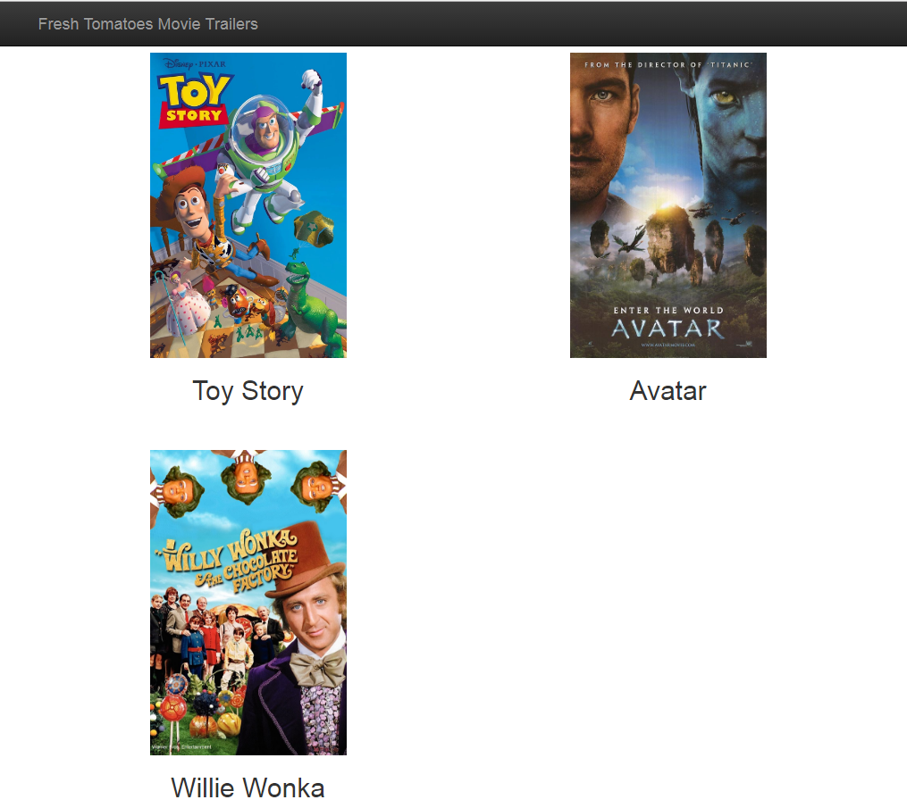
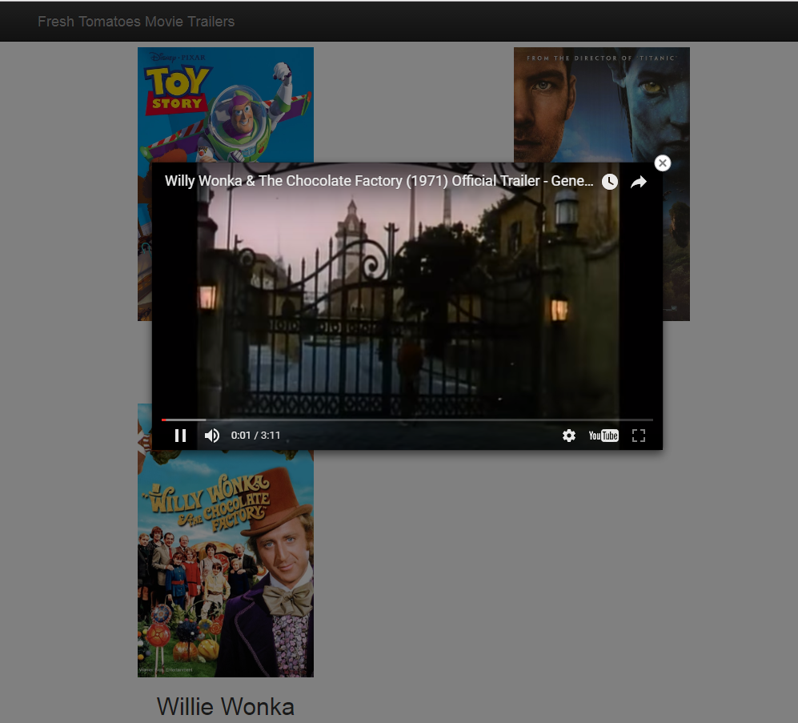

# Ud-city_Nan0degree
Coursework and Projects for this course

- This is coursework done for the
  "Intro to Programming" Nanodegree.
  
- Obtained a Full Scholarship through
  AT and T's "Aspire to Tech" Programme
  to take this course.
  
- Really grateful. You can also read about my 
  progress on my blog : https://kammitama5.github.io/
  
## General Notes

- [Literate Programming](http://www.literateprogramming.com/)

- Literate Programming language -> [Eve](http://play.witheve.com/#/examples/quickstart.eve)
  
 ## Using Turtle! (Chapter 4)


## Making a movie Website that gives descriptions of your favourite movies! (Chapter 4)



## And plays trailers from those movies (when image is clicked)




- Courtesy of fresh_tomatoes.py via Udacity


## Anaconda (Data Analyst) path 

## Notes

- create with python 3 -> ```conda create -n filename python=3``` 

- ```source activate``` or ```activate``` (Windows)

- ```conda list``` to see packages installed 

- ```conda install matplotlib numpy pandas jupyter notebook``` installs packages simultaneously

- ```conda search``` search term

- ```conda env export > environment.yaml``` - pipe environment settings to yaml file

- ```conda env remove -n env_name``` - removes specified environment (here named env_name)

## Tools 

- **Anaconda Navigator:** GUI for managing environments and packages

- **Anaconda Prompt:** Terminal can use with cli to manage envs and packages

- **Spyder:** IDE for scientific development 


